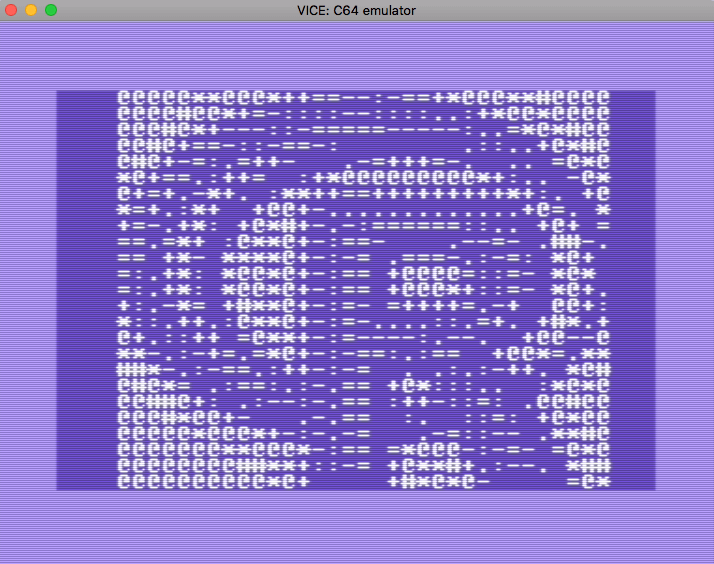

```{r setup, include = FALSE}
suppressPackageStartupMessages({
  library(dplyr)
  library(magick)
  library(r64)
})
knitr::opts_chunk$set(
  collapse = TRUE,
  comment = "#>"
)
```

ASCII
------------------------------------------------------------------------------

In this vignette, we are going to:

* generate a 40x25 character ASCII representation of the R logo
* Incorporate that text into an R program using the `r64` package
* Compile the code


Create very small ASCII art (40x25)
------------------------------------------------------------------------------

```{r}
library(r64)
library(magick)


#-----------------------------------------------------------------------------
# Some character set in density order.
# Depending on white-on-black or black-on-white, 
# the order may need to be reversed
#-----------------------------------------------------------------------------
alpha <- ' .:-=+*#%@'
C     <- (strsplit(alpha,'')[[1]])


#-----------------------------------------------------------------------------
# Read the standard Rlogo jpg and extract just a
# small grayscale representation
#-----------------------------------------------------------------------------
im <- magick::image_read(jpeg::readJPEG(system.file('img/Rlogo.jpg',package='jpeg'))) %>%
  magick::image_resize(geometry = "40x25") %>%
  magick::image_convert(colorspace='Gray') %>%
  magick::as_EBImage() %>%
  as.matrix()
im <- t(im@.Data)


#-----------------------------------------------------------------------------
# Cut the image into qunatiles, with each interval represented by a
# different character in the sequence
#-----------------------------------------------------------------------------
qs     <- quantile(im, p=seq(0,1,,length(C)))
levels <- findInterval(im, qs)
im[]   <- C[levels]


#-----------------------------------------------------------------------------
# pad out to 40 cols with blanks
#-----------------------------------------------------------------------------
extra_cols <- 40 - ncol(im)
blank_col <- rep(' ', nrow(im))
for (idx in seq_len(extra_cols)) {
  if (idx %% 2 == 0) {
    im <- cbind(im, blank_col)
  } else {
    im <- cbind(blank_col, im)
  }
}


#-----------------------------------------------------------------------------
# Extra rows
#-----------------------------------------------------------------------------
extra_rows <- 25 - nrow(im)
blank_row <- rep(' ', ncol(im))
for (idx in seq_len(extra_rows)) {
  if (idx %% 2 == 0) {
    im <- rbind(im, blank_row)
  } else {
    im <- rbind(blank_row, im)
  }
}
```


```{r}
cat(apply(im, 1, paste,collapse=''), sep='\n')
```


Incorporate text from R into a c64 program
------------------------------------------------------------------------------

```{r}
#-----------------------------------------------------------------------------
# Convert to 4 strings, each with 250 chars, so that we can loop
# over them on an 8-bit computer
#-----------------------------------------------------------------------------
rchars <- as.vector(t(im))
rmessage1 <- rchars[  1:250] %>% paste(collapse='')
rmessage2 <- rchars[251:500] %>% paste(collapse='')
rmessage3 <- rchars[501:750] %>% paste(collapse='')
rmessage4 <- rchars[751:999] %>% paste(collapse='')


asm <- '*=$0801
.byte $0c, $08, $0a, $00, $9e, $20
.byte $32, $30, $38, $30, $00, $00
.byte $00
*=$0820
  lda #$93
  jsr $ffd2

  lda #$0e   ; Switch to lowercase/upperase character mode
  jsr $ffd2

  ;lda #$01   ; set background to white
  ;sta $d020
  ;sta $d021

  lda #$01   ; set text to black
  sta $0286

  ldy #$00
  loop1 lda message1,y
  jsr $ffd2
  iny
  cpy #$fa
  bne loop1

  ldy #$00
loop2
  lda message2,y
  jsr $ffd2
  iny
  cpy #$fa
  bne loop2

  ldy #$00
loop3
  lda message3,y
  jsr $ffd2
  iny
  cpy #$fa
  bne loop3

  ldy #$00
loop4
  lda message4,y
  jsr $ffd2
  iny
  cpy #$f9
  bne loop4


wait
  jmp wait

message1
  .rtext rmessage1   ; ".rtext" instructions are directives to include the contents of a string from R at this location
message2
  .rtext rmessage2
message3
  .rtext rmessage3
message4
  .rtext rmessage4
'
```


```{r}
prg_df <- r64::compile(asm)
```

```{r}
prg_df %>% 
  select(addr, line, op, opmode)
```

```{r eval=FALSE}
outfile <- tempfile()
r64::save_prg(prg_df, outfile)
system(paste("/usr/local/opt/vice/x64.app/Contents/MacOS/x64", outfile))
```




