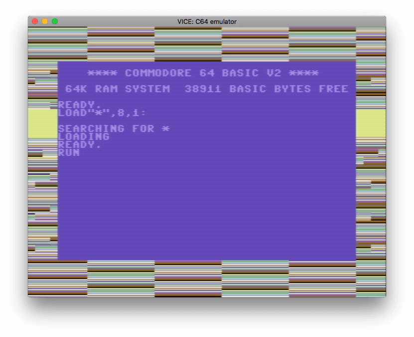

```{r setup, include = FALSE}
suppressPackageStartupMessages({
  library(r64)  
})

knitr::opts_chunk$set(
  collapse = TRUE,
  comment = "#>"
)
```


Write your c64 ASM code to flash the screen border
------------------------------------------------------------------------------

```{r}
asm <- '
*=$0801                               ; This is the BASIC stub which will run the code
  .byte $0c, $08, $0a, $00, $9e, $20  ; 10 SYS 2080
  .byte $32, $30, $38, $30, $00, $00
  .byte $00

*=$0820             ; Set address for this code. $0820 = 2080
loop
      inc $d020     ; increase the border colour memory location
      jmp loop      ; repeat forever
'
```


Compile ASM code to PRG
------------------------------------------------------------------------------

```{r}
library(r64)

## Manual compilation steps if debugging
# line_tokens <- r64::create_line_tokens(asm)
# prg_df      <- r64::create_prg_df(line_tokens)
# prg_df      <- r64::process_symbols(prg_df)
# prg_df      <- r64::process_zero_padding(prg_df)

# compile and save code
prg_df       <- r64::compile(asm)
prg_filename <- "../prg/helloborder.prg"

r64::save_prg(prg_df, prg_filename)
```

See the `prg` directory in this package for ready-to-run PRGs of this code.


Compare the output with a more complete compiler (TASS64)
------------------------------------------------------------------------------

* Since we haven't used an R-specific features, this should compile to the 
  identical bytes using the TASS64 compiler.
  
```{r}
tass <- r64::TASS$new(asm = asm)
tass$compile()
tass$get_prg()

identical(r64::extract_prg_bytes(prg_df), tass$get_prg())
```


Run code in an emulator
------------------------------------------------------------------------------

```{r eval=FALSE}
system(paste("/usr/local/opt/vice/x64.app/Contents/MacOS/x64 -VICIIfilter 0 -silent", prg_filename), wait=FALSE)
```





