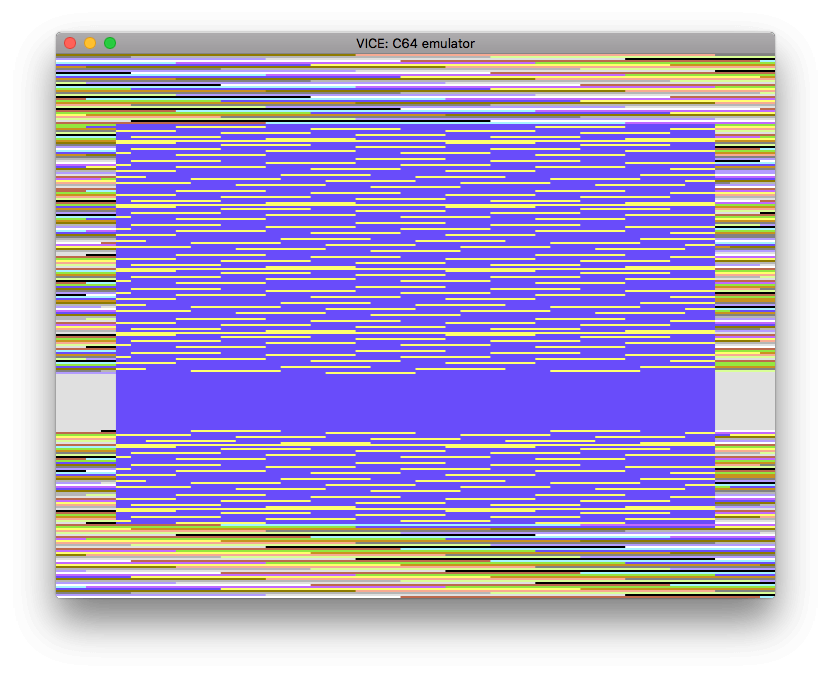

```{r setup, include = FALSE}
suppressPackageStartupMessages({
  library(r64)  
})

knitr::opts_chunk$set(
  collapse = TRUE,
  comment = "#>"
)
```

Symbol and PC arithmetic
------------------------------------------------------------------------------

* To make writing code easier, most 6502 assemblers support arithmetic on symbols and the program counter.
* These calculations are resolved at compile time
* This is useful for: 
    * jumping to a location 10 bytes ahead: `jmp {.* + 10}`
    * indexing byte offset from a known location:  `lda {message + 20}`
* `r64` allows
    * bare symbols to refer to values e.g. `border` 
    * use of `.*` to refer to the current address at the start of this instruction
    * arithmetic on the symbols must be wrapped in `{}`
* Internally, the contents of `{}` are evaluated with `eval(parse(text=...))` with an environment consisting
  of all known variables and the current address


```{r}
library(r64)

asm <- '
*=$0801
  .byte $0c, $08, $0a, $00, $9e, $20
  .byte $32, $30, $38, $30, $00, $00
  .byte $00

border = $d020         ; use a variable/symbol for the border colour memory loation

*=$0820
      lda #$93         ; Clear the screen
      jsr $ffd2

loop  
      inc border       ; increment the memory location responsible for border colour
crap
      inc {border + 1} ; increase the memory location at `border+1` i.e. $d021 (screen colour)
      dec {border + 1} ; decrease it
      jmp {.* + 6}     ; skip 6 bytes ahead from the start of this line
      nop
      nop
      nop
      jmp {crap - 3}   ; jmp to the location 3 bytes before `crap` i.e. `loop`
'
```


Compile ASM code to PRG
------------------------------------------------------------------------------

```{r eval=FALSE}
library(r64)

## Manual compilation steps if debugging
# line_tokens <- r64::create_line_tokens(asm)
# prg_df      <- r64::create_prg_df(line_tokens)
# prg_df      <- r64::process_symbols(prg_df)
# prg_df      <- r64::process_zero_padding(prg_df)

# compile and save code
prg_df       <- r64::compile(asm)
prg_filename <- "../prg/symbol-arithmetic.prg"

r64::save_prg(prg_df, prg_filename)
```

See the `prg` directory in this package for ready-to-run PRGs of this code.


Run code in an emulator
------------------------------------------------------------------------------

```{r eval=FALSE}
system(paste("/usr/local/opt/vice/x64.app/Contents/MacOS/x64 -VICIIfilter 0 -silent", prg_filename), wait=FALSE)
```



